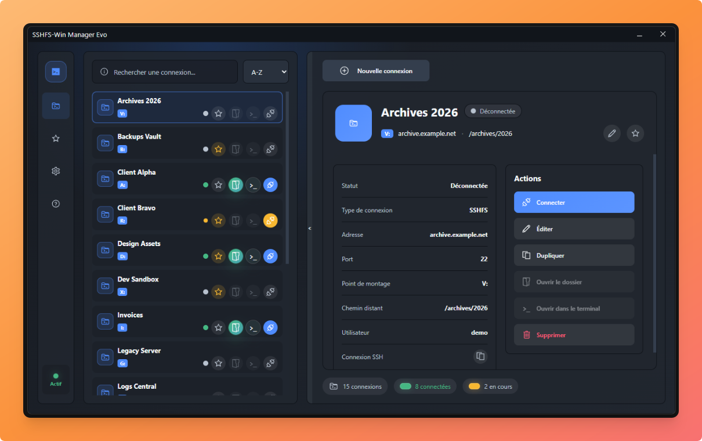
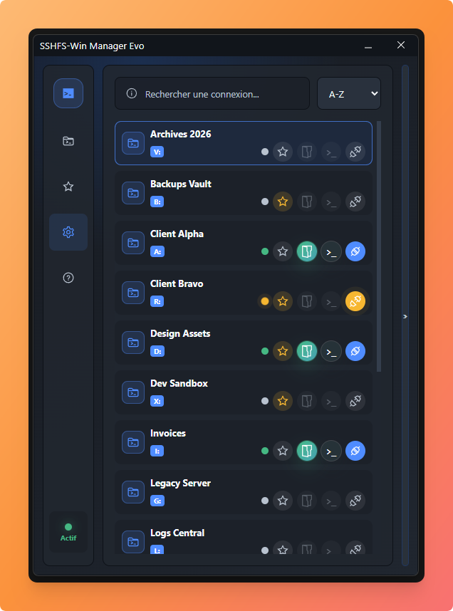

# SSHFS-Win Manager Evo

Interface graphique Windows pour monter des dossiers distants via SSHFS-Win.

SSHFS-Win Manager Evo est un fork modernisé de [SSHFS-Win Manager](https://github.com/evsar3/sshfs-win-manager), créé à l'origine par Evandro Araujo. Cette édition ajoute une interface revue, de nouveaux modes d'authentification, des outils de gestion des connexions et plusieurs corrections adaptées aux versions récentes de Windows.

## Aperçu

  

Vue principale de SSHFS-Win Manager Evo.

Mode compact :

Ajout d'une connexion :

## Fonctionnalités

- Montage de dossiers distants SSH/SFTP en lecteur Windows via SSHFS-Win.
- Gestion de plusieurs connexions avec favoris, recherche et tri.
- Fiche détaillée par connexion avec statut, host, port, utilisateur, chemin distant et point de montage.
- Icône personnalisable par connexion, affichée dans la liste et dans la fiche détail.
- Attribution automatique d'une lettre de lecteur libre avec `Auto (next free letter)`.
- Copie rapide d'une commande `ssh` équivalente pour ouvrir la connexion dans un terminal.
- Import/export JSON des connexions.
- Import de l'ancienne configuration SSHFS-Win Manager depuis `%APPDATA%\sshfs-win-manager\vuex.json`.
- Interface multilingue avec sélection de la langue dans les paramètres.
- Mode debug intégré avec logs de connexion.
- Démarrage avec Windows et fonctionnement dans la zone de notification.
- Connexion automatique au démarrage, exécutée de façon séquentielle pour éviter les collisions.
- Support IPv6 dans les cibles SSHFS.
- Paramètres avancés SSHFS via options de ligne de commande personnalisées.

## Modes d'authentification

Le logiciel prend en charge plusieurs modes selon la configuration du serveur SSH :

- `Private Key`
- `Private Key + Passphrase`
- `Private Key + PAM/OTP`
- `Private Key + Passphrase + PAM/OTP`
- `Password`
- `Password (ask on connect)`
- `PAM/OTP only (no key) [BETA]`

Les modes PAM/OTP utilisent `keyboard-interactive` et peuvent servir avec des configurations PAM, TOTP, OTP, Radius ou MFA. Les secrets saisis dans les popups de connexion ne sont pas enregistrés dans la configuration.

## Sécurisation des mots de passe

Les mots de passe enregistrés ne sont plus stockés en clair dans la configuration.

SSHFS-Win Manager Evo utilise une **passkey globale** au logiciel pour chiffrer les secrets directement dans le JSON de configuration. Cela permet de conserver un fichier exportable/importable tout en évitant de laisser les mots de passe lisibles.

Fonctionnement :

- Les mots de passe sont chiffrés avec `AES-256-GCM`.
- La clé de chiffrement est dérivée de la passkey globale avec `scrypt`.
- La passkey n'est pas enregistrée.
- À l'ouverture, si des secrets chiffrés sont détectés, l'application demande la passkey.
- La passkey peut être gardée en mémoire temporairement selon le réglage choisi : toujours demander, 1 heure, 12 heures ou 2 jours.
- Si une connexion en mode `Password` n'a pas encore de mot de passe chiffré, l'application le demande à la connexion puis le chiffre pour les prochaines utilisations.
- Les anciens mots de passe en clair sont migrés automatiquement vers le format chiffré.

Important : si la passkey est perdue, les mots de passe chiffrés ne peuvent pas être récupérés. Les connexions restent présentes, mais les secrets devront être ressaisis.

## Prérequis

Avant d'utiliser l'application sous Windows, installez :

- [WinFsp](https://winfsp.dev/)
- [SSHFS-Win](https://github.com/billziss-gh/sshfs-win)

SSHFS-Win Manager Evo ne remplace pas SSHFS-Win : il fournit l'interface graphique et pilote `sshfs.exe`.

Pour preparer un test sous Linux ou macOS, consultez [install.md](install.md).

## Installation

1. Installez WinFsp et SSHFS-Win.
2. Installez ou compilez SSHFS-Win Manager Evo.
3. Ajoutez une connexion.
4. Choisissez une lettre de lecteur disponible.
5. Cliquez sur `Connecter`.

## Langues

L'application prend en charge plusieurs langues d'interface.

Langues disponibles actuellement :

- Français
- Anglais

La langue se change depuis `Paramètres` > `Langue`. Le choix est enregistré dans la configuration locale et réappliqué au prochain lancement.

## Développement

Les informations de développement, de build, de lint et de génération des icônes sont regroupées dans [CONTRIBUTING.md](CONTRIBUTING.md).

## Notes importantes

- Le mode `Auto (next free letter)` est géré par l'application : une vraie lettre libre est choisie avant le lancement de SSHFS-Win. L'application ne délègue pas la valeur `auto` à `sshfs.exe`.
- Certaines authentifications interactives dépendent fortement de la configuration OpenSSH/PAM du serveur.
- Pour les clés protégées par passphrase et les challenges PAM/OTP, l'application prépare les réponses avant de lancer SSHFS via `SSH_ASKPASS`.
- Les images personnalisées de connexions sont stockées dans les données de configuration sous forme de data URL.

## Projet original

Ce projet est basé sur SSHFS-Win Manager :

[https://github.com/evsar3/sshfs-win-manager](https://github.com/evsar3/sshfs-win-manager)

Auteur original : Evandro Araujo.

Édition Evo : Fabrice Simonet, [emulsion.io](https://emulsion.io).

## Licence

MIT License

Copyright (c) 2020 Evandro Araujo

Modifications copyright (c) 2026 Fabrice Simonet

Permission is hereby granted, free of charge, to any person obtaining a copy
of this software and associated documentation files (the "Software"), to deal
in the Software without restriction, including without limitation the rights
to use, copy, modify, merge, publish, distribute, sublicense, and/or sell
copies of the Software, and to permit persons to whom the Software is
furnished to do so, subject to the following conditions:

The above copyright notice and this permission notice shall be included in all
copies or substantial portions of the Software.

THE SOFTWARE IS PROVIDED "AS IS", WITHOUT WARRANTY OF ANY KIND, EXPRESS OR
IMPLIED, INCLUDING BUT NOT LIMITED TO THE WARRANTIES OF MERCHANTABILITY,
FITNESS FOR A PARTICULAR PURPOSE AND NONINFRINGEMENT. IN NO EVENT SHALL THE
AUTHORS OR COPYRIGHT HOLDERS BE LIABLE FOR ANY CLAIM, DAMAGES OR OTHER
LIABILITY, WHETHER IN AN ACTION OF CONTRACT, TORT OR OTHERWISE, ARISING FROM,
OUT OF OR IN CONNECTION WITH THE SOFTWARE OR THE USE OR OTHER DEALINGS IN THE
SOFTWARE.
